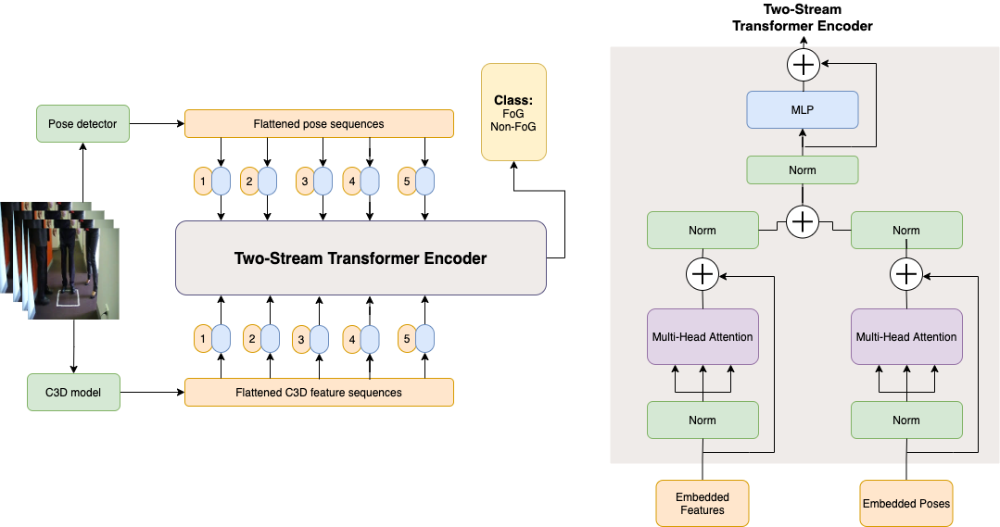

# Two stream transformer
In light of two papers [Attention is all you need](https://arxiv.org/abs/1706.03762) and [An image is worth 16*16 words](https://arxiv.org/abs/2010.11929), this work extends the Transformer network to handle video input. Briefly, video is viewed as a bunch of sequences among which self-attention is calculated.

## Network architecture

## Data preparation
Video data needs to be converted to two types of sequences: pose sequences and appearance sequences. We use convolutional pose machines for pose estimation and convolutional 3D network for appearance feature extraction. Please refer to the below links for the details:

Convolutional pose machines: https://github.com/shihenw/convolutional-pose-machines-release

Pretrained C3d model on Sports1M: https://github.com/DavideA/c3d-pytorch